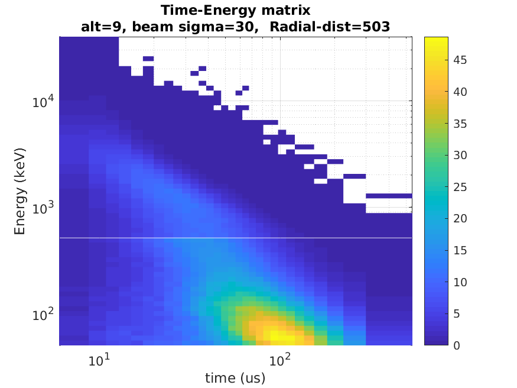
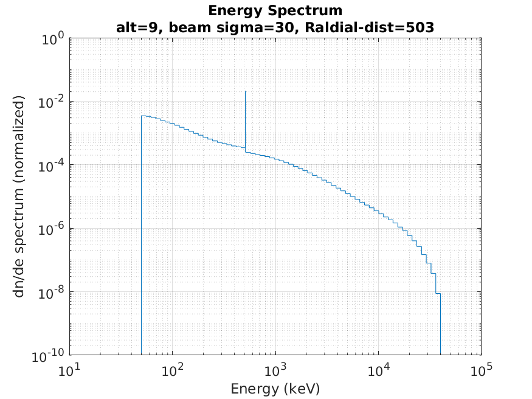
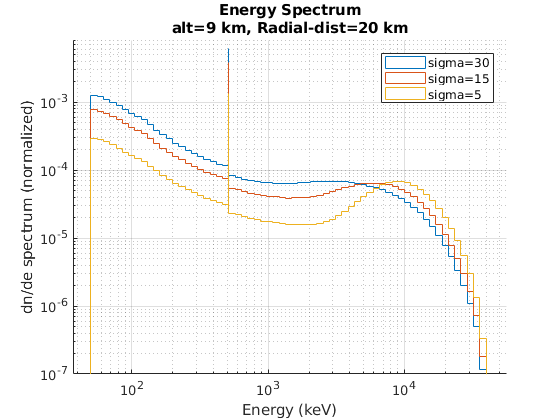
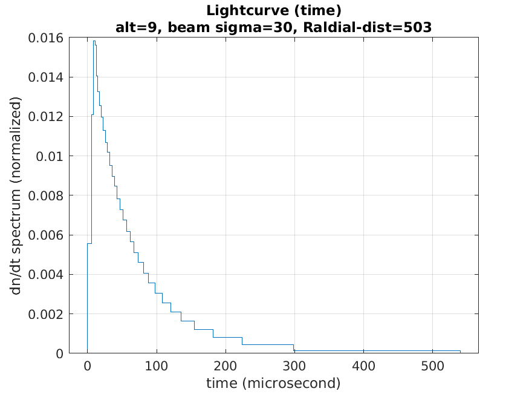

* MATLAB code to generate Terrestrial Gamma-Ray Flashes (TGF) spectrums, lightcurves and time-energy matrices. Fluence profiles as function of radial distance (TGF to satellite) are also available, in the folder `Fluence_RadialDistance_Profiles`. See `README.md` inside.
* Use the script `get_TGF_time_energy_matrix_write_to_files.m` to generate spectrums, lightcurves and time-energy matrices (and edit the wanted values).
* Output files are written in the `OUTPUT` folder. The matrix time and energy grids are the same as the spectrum and lightcurve. Generated plots are written in the `PLOTS` folder.
* The simulations assume a RREA TGF source energy spectrum (1/E*exp(-E/7.3MeV)) and a gaussian beaming (angular distribution) centered towards zenith.
* Output energies are between 50 keV and 40 MeV.
* Possibilities:
  * Available altitudes are 9, 11, 13, 15, 17 and 19 km. 
  * Available beaming angles are sigma of 5, 10, 15, 22, 30 and 40 degrees.
  * Available radial distances are between 0 and 800 km. The radial distance is defined as the arclength distance (at sea level) between the TGF and the satellite (detector) positions.
  * the satellite detecting the TGF is assumed at 400 km altitude (other altitudes can be obtained by projection)

* The data was generated using the Geant4 (Monte-Carlo) based code available here: 
https://github.com/DavidSarria89/TGF-Propagation-Geant4/
* A substantial anount if CPU time was required to produce the library. The simulations were performed on resources provided by UNINETTSigma2—the National Infrastructure for High Performance Computing and Data Storage in Norway, under Project number NN9526K.

* Simulation raw data backup .mat files : https://filesender.uninett.no/?s=download&token=6f098351-f71f-4d71-9825-876b0f6ce36b

* Example plots:

